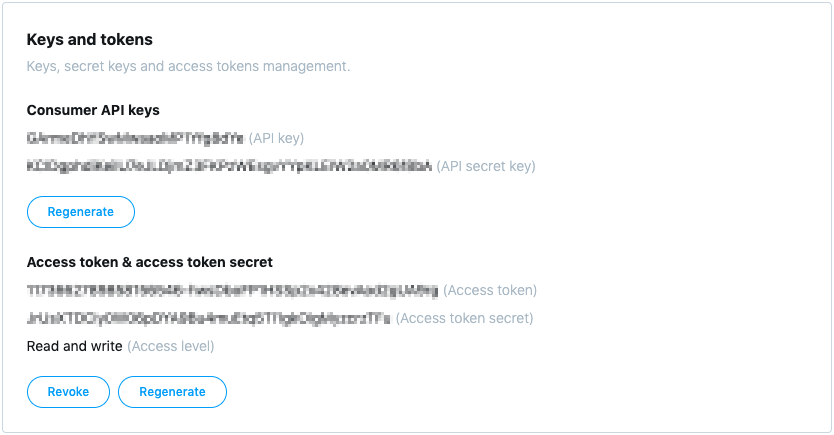

<h1 align="center">Pardal Team</h1>
<p align="center">Análise de Sentimentos em Tweets</p>

## Equipe

- [Abílio Nogueira](https://github.com/AbilioNB)
- [Edilson Alves](https://github.com/edilsonalves)

## Entregas

1. [Artigos e produtos relacionados e datasets](./deliveries/01.md)
2. [Pré-processamento e classificação](./deliveries/02.md)
3. [Primeira versão dos algoritmos](./deliveries/entregas_finais.md)
4. [Interface do sistema](./deliveries/entregas_finais.md)
5. [Resultado final e interface final](./deliveries/entregas_finais.md)

[Plataforma Web](https://twinaliser.herokuapp.com/)

## Execução

Para executar a aplicação é necessário possuir uma conta de desenvolvedor no Twitter, o objetivo é gerar as chaves e tokens necessários para comunicação com a API oficial da plataforma.

<p align="center">
  
</p>

### Passos

Clonar repositório:

`$ git clone https://github.com/ufrpe-mineracao-textos/projeto-de-mineracao-20192-pardal-team.git`

Acessar diretório:

`$ cd projeto-de-mineracao-20192-pardal-team/pardal/application`

Criar arquivo .env:

`$ touch .env`

Criar variáveis de ambiente com as chaves e tokens gerados (arquivo .env):

```
CONSUMER_KEY=INSERIR_API_KEY
CONSUMER_SECRET=INSERIR_API_SECRET_KEY
ACCESS_TOKEN=INSERIR_ACCESS_TOKEN
ACCESS_TOKEN_SECRET=INSERIR_ACCESS_TOKEN_SECRET
```

Criar ambiente virtual:

`$ python -m venv .venv`

Ativar ambiente virtual:

`$ source .venv/bin/activate`

Instalar dependências:

`$ pip install -r requirements.txt`

Executar aplicação:

`$ python app.py`

Acessar aplicação:

`http://127.0.0.1:5000`
